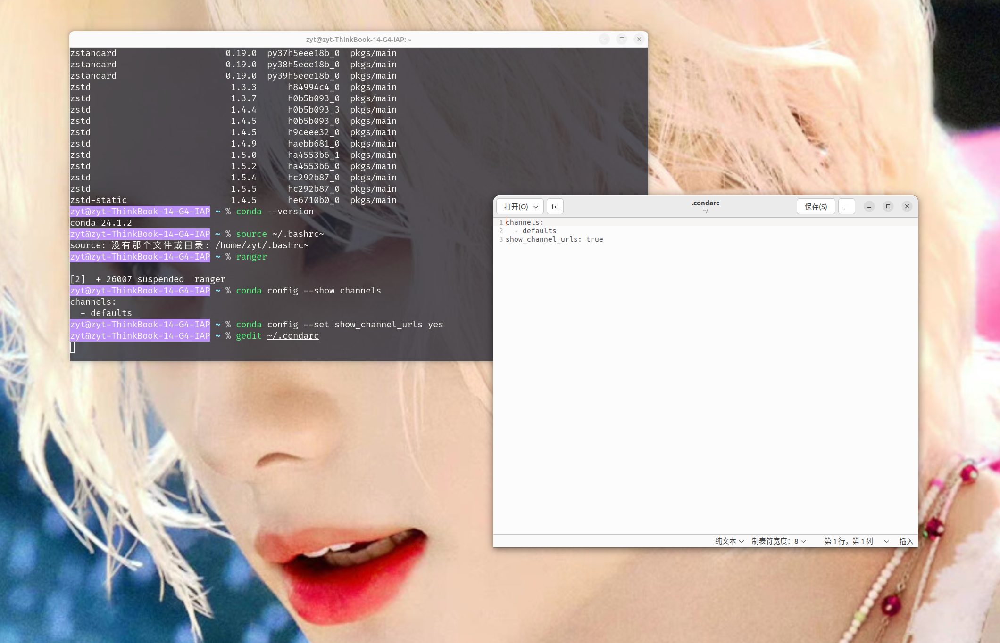
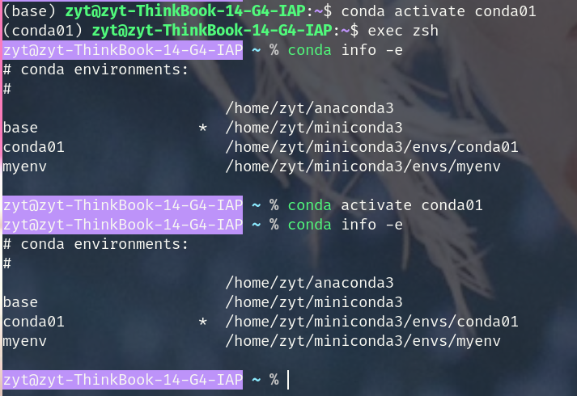

## 关于Conda

> Conda 是一个是为 Python 而设的开源包管理系统和环境管理系统，用于安装 Python 及相应的包（库），其实就是 Python 环境安装、运行、管理平台，也就是说，Conda 已经附带有了 Python，安装了它就不需要另外安装 Python 了。
>
> 之所以选择安装 Conda 来代替单独安装 Python，是因为：单独安装 Python 后，当需要安装其他包（库），特别是第三方包（库）的时候，Python 的包管理工具 pip 在下载安装包过程中往往会出现这样或那样的问题，比如会忽略某个包的其他依赖包，这样会造成该包在安装后不能使用的情况，这就是大家经常吐槽的所谓的各种“坑”；而利用 Conda 来安装这些软件包就可以避免出现这些错误。
>
> Conda 分为 Anaconda 和 Miniconda 两个版本，两个都是开源（免费）的。其中 Anaconda 可以说是 Conda 的大型版本，安装了很多的软件包；而 Miniconda 是 Conda 的最小安装程序（即Conda 的迷你版），可以说是 Anaconda 的一个简化版本，只包含 conda、Python 及其依赖的包，以及其他少量常用的包。
>
> 对大多数人来说，没有必要安装 Anaconda ， 因为它附带的东西太多，很多软件包可能暂时甚至永远都用不上，很占空间，甚至拖慢电脑。可以下载安装 Miniconda，等您需要某个包时，再安装也不迟，没有必要一开始就把所有东西都装上。

>
>
> conda 分为 anaconda 和 miniconda。anaconda 是包含 python、conda 及一些常用包的版本，如 numpy、pandas、scipy等，anaconda 下载文件较大，约 531 MB。miniconda 是 anaconda 的精简版，仅包含 conda 和 python，其余安装包需要自己手动安装。推荐使用 miniconda。
>
> conda 是一个开源的 包管理系统和环境管理系统。python 的库非常广泛，但随着 python 版本的不断更新，许多未更新的库与最新版 python 之间出现了不兼容的情况。糟糕的情况可能是需要使用的多个库之间依赖的 python 版本不同，有的是 python3，有的是 python2。为了处理这种情况，conda 将包、包的依赖、python 版本等封装在特定 “容器” 中，“容器” 之间互不干扰并可以轻松切换。
>
> 随着 conda 的广泛使用，现在不仅仅只用于管理 python 的包和依赖，许多其他软件也支持使用 conda 安装。如 SLiM 是一个用 C 语言编写的软件，在本地使用源代码解压编译时一直报错，虽然知道是编译器版本问题，但如果简单的替换或者升级本地的编译器，又担心编译器会与其他的软件再出现矛盾。这里就可以使用 conda 来安装 SLiM，将 SLiM 及所需要的编译器封装在特定 “容器” 中。
> ————————————————
>
>     版权声明：本文为博主原创文章，遵循 CC 4.0 BY-SA 版权协议，转载请附上原文出处链接和本声明。
>
> 原文链接：https://blog.csdn.net/sinat_41621566/article/details/117904144

## x下载

[官网点我](https://docs.anaconda.com/free/miniconda/)

命令行下载：（ps这里的第二三行是同一条命令来的只是显示问题，wget那一条非常长)

```
mkdir -p ~/miniconda3
wget https://repo.anaconda.com/miniconda/Miniconda3-latest-Linux-x86_64.sh -O ~/miniconda3/miniconda.sh
bash ~/miniconda3/miniconda.sh -b -u -p ~/miniconda3
rm -rf ~/miniconda3/miniconda.sh
```

> Let me explain what each command does:
>
> 1. `mkdir -p ~/miniconda3`: This command creates a directory named `miniconda3` in your home (`~`) directory. The `-p` option ensures that the command creates parent directories if they do not exist.
> 2. `wget https://repo.anaconda.com/miniconda/Miniconda3-latest-Linux-x86_64.sh -O ~/miniconda3/miniconda.sh`: This command downloads the latest Miniconda installer script for Linux and saves it as `miniconda.sh` in the previously created `miniconda3` directory.
> 3. `bash ~/miniconda3/miniconda.sh -b -u -p ~/miniconda3`: This command executes the Miniconda installer script (`miniconda.sh`). The options used are:
>
>    - `-b`: Enables batch mode, which skips the user prompts and assumes default answers.
>    - `-u`: Updates the existing installation if a previous version of Miniconda is detected.
>    - `-p ~/miniconda3`: Specifies the target installation directory.
> 4. `rm -rf ~/miniconda3/miniconda.sh`: This command removes the downloaded Miniconda installer script (`miniconda.sh`) after the installation is complete. The `-rf` options force the removal without prompting and recursively remove directories.
>
> After running these commands, you should have Miniconda installed in the `~/miniconda3` directory on your Linux system. Make sure to activate the Miniconda environment by running `source ~/miniconda3/bin/activate` or by adding the Miniconda `bin` directory to your system's `PATH` variable.

下载完成之后，初始化bash和zsh

```
~/miniconda3/bin/conda init bash
~/miniconda3/bin/conda init zsh
```

激活配置

`source ~/.zshrc`

`source ~/.bashrc`

测试

`conda --version`


## 换源

来源：https://mirrors.tuna.tsinghua.edu.cn/help/anaconda/

可以使用 `conda config --show channels` 命令查看当前的源


////创建.condarc文件：  `conda config --set show_channel_urls yes`

并打开编辑模式 `gedit ~/.condarc`



并添加下列内容

```
channels:
  - defaults
show_channel_urls: true
default_channels:
  - https://mirrors.tuna.tsinghua.edu.cn/anaconda/pkgs/main
  - https://mirrors.tuna.tsinghua.edu.cn/anaconda/pkgs/r
  - https://mirrors.tuna.tsinghua.edu.cn/anaconda/pkgs/msys2
custom_channels:
  conda-forge: https://mirrors.tuna.tsinghua.edu.cn/anaconda/cloud
  msys2: https://mirrors.tuna.tsinghua.edu.cn/anaconda/cloud
  bioconda: https://mirrors.tuna.tsinghua.edu.cn/anaconda/cloud
  menpo: https://mirrors.tuna.tsinghua.edu.cn/anaconda/cloud
  pytorch: https://mirrors.tuna.tsinghua.edu.cn/anaconda/cloud
  pytorch-lts: https://mirrors.tuna.tsinghua.edu.cn/anaconda/cloud
  simpleitk: https://mirrors.tuna.tsinghua.edu.cn/anaconda/cloud
  deepmodeling: https://mirrors.tuna.tsinghua.edu.cn/anaconda/cloud/
```

运行 **`conda clean -i`** 清除索引缓存，保证用的是镜像站提供的索引。

运行 `conda create -n myenv numpy` 测试一下吧。

## CLI

创建环境：

```
conda create -n <name> 
```

切换/退出环境

```text
conda activate <name>
conda deactivate
```

若在bash中是可以看到前面括号表示的所在环境的，若是在zsh可以通过 `conda info -e ` 查看，前面带星号的就是所在的环境。



删除已有环境

```text
conda remove -n env_name --all
```

安装/删除包

```text
conda install pkg_name
conda remove -n env_name pkg_name
```

虽然conda和pip一样可以用于包管理，但pip搜索到的环境会更多一些。推荐优先用pip下载包

查看已经安装的包

```etext
conda list
```


## Conda in RaspberryPi

树莓派并不是64bits架构，不能使用以上的安装包，应该用arch的

```
wget https://repo.anaconda.com/miniconda/Miniconda3-py37_4.9.2-Linux-aarch64.sh
```

然后运行安装包(不要加sudo，不然处理权限太麻烦了)

```
bash  Miniconda3-py37_4.9.2-Linux-aarch64.sh
```

然后安装程序会自动把conda下载到`~/miniconda3`文件夹里

然后就可以把安装包踢掉了

```
rm Miniconda3-py37_4.9.2-Linux-aarch64.sh 
```

添加环境变量：(记得改路径！)

```
echo 'export PATH="/home/zyt-rasp/miniconda3/bin:$PATH"' >> ~/.bashrc
```

然后`source ~/.bashrc`即可

