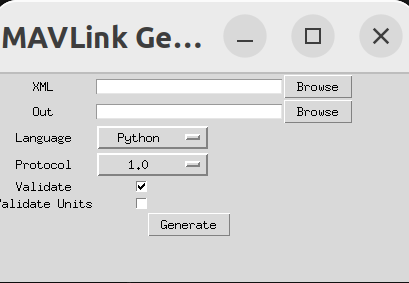

指路：

战队git  [ControlFamily/mavlink - mavlink - 你好，世界](http://10.249.19.53:3000/ControlFamily/mavlink)

XieYang靴长的GitHub：[MirTITH/WTR-Mavlink-Library: 移植到 stm32 平台的 mavlink (github.com)](https://github.com/MirTITH/WTR-Mavlink-Library/tree/main)


参考：

[Mavlink协议理解Pixhawk APM（一）_crc_extra-CSDN博客](https://blog.csdn.net/super_mice/article/details/44836585)

# 协议

## 帧结构


（此图为v1，v2和它的区别就是MSG从一字节变成了三字节，消息ID更充裕）

Mavlink传输时的基本单位是帧，帧结构如图

灰色部分`payload`是传输的数据内容

红色的是起始标志位（stx），在v1.0版本中以“FE”作为起始标志。这个标志位在mavlink消息帧接收端进行消息解码时有用处。

第二个格子代表的是灰色部分（payload，称作有效载荷，要用的数据在有效载荷里面）的字节长度（len），范围从0到255之间。在mavlink消息帧接收端可以用它和实际收到的有效载荷的长度比较，以验证有效载荷的长度是否正确。

第三个格子代表的是本次消息帧的序号（seq），每次发完一个消息，这个字节的内容会加1，加到255后会从0重新开始。这个序号用于mavlink消息帧接收端计算消息丢失比例用的，相当于是信号强度。

第四个格子代表了发送本条消息帧的设备的系统编号（sys），使用PIXHAWK刷PX4固件时默认的系统编号为1，用于mavlink消息帧接收端识别是哪个设备发来的消息。

第五个格子代表了发送本条消息帧的设备的单元编号（comp），使用PIXHAWK刷PX4固件时默认的单元编号为50，用于mavlink消息帧接收端识别是设备的哪个单元发来的消息（暂时没什么用） 。

**第六个格子代表了有效载荷中消息包的编号（msg），注意它和序号是不同的，这个字节很重要，mavlink消息帧接收端要根据这个编号来确定有效载荷里到底放了什么消息包并根据编号选择对应的方式来处理有效载荷里的信息包。**（在mavgenerate自动生成的C语言库文件中，每个msgid编号的消息分别对应有一个头文件，里面有对应的发送和解包函数）

最后两个字节是16位校验位，ckb是高八位，cka是低八位。校验码由crc16算法得到，算法将整个消息（从起始位开始到有效载荷结束，还要额外加上个MAVLINK_CRC_EXTRA字节）进行crc16计算，得出一个16位的校验码。之前提到的每种有效载荷里信息包（由消息包编号来表明是哪种消息包）会对应一个MAVLINK_CRC_EXTRA，这个 MAVLINK_CRC_EXTRA 是由生成mavlink代码的xml文件生成的，加入这个额外的东西是为了当飞行器和地面站使用不同版本的mavlink协议时，双方计算得到的校验码会不同，这样不同版本间的mavlink协议就不会在一起正常工作，避免了由于不同版本间通讯时带来的重大潜在问题。


在代码实现中我们需要关注的就只有MSGID和Payload的内容，发送解包和校验都可以由封装好的库函数完成。


# C_language

## Quick start

### Generate C headers

To install the minimal MAVLink environment on Ubuntu LTS 20.04 or 22.04, enter the following on a terminal:（Windows也一样)

```bash
# Dependencies
sudo apt install python3-pip

# Clone mavlink into the directory of your choice
git clone https://github.com/mavlink/mavlink.git --recursive
cd mavlink

python3 -m pip install -r pymavlink/requirements.txt
```

然后输入 `python mavgenerate.py	` (注：此电脑保存该库的位置是"D:\_电控_\MAVLink_lib\lib\mavlink")

就可以见到这个小小的图形化窗口。



把language换成C，XML传入自己写好的文件，Out填入要用来放置头文件的文件夹（一般与XML放在一起)，然后generate即可

不过实际用的时候一般只需要在[老登祖传代码](http://10.249.19.53:3000/CYT/R1_Upper/src/branch/main/UserCode/Lib/Mavlink)
里面找到wtr_mavlink.c和.h,把这个.h文件包含起来就够了


# Python

官网：

[Pymavlink (Python-mavgen) · MAVLink Developer Guide](https://mavlink.io/en/mavgen_python/)

## Quick Start

用上述方法同样生成python的文件

然后，克隆这个仓库[ArduPilot/pymavlink at f4e45e4ce2ecb84a9d6aaf1cbed84e2fe1535312 (github.com)](https://github.com/ArduPilot/pymavlink/tree/f4e45e4ce2ecb84a9d6aaf1cbed84e2fe1535312)

下载到系统后把刚刚生成的.py文件放在`dialects`文件夹的`v10`或`v20`中，具体是什么看你用的是哪个版本

然后回到仓库的根目录，运行python安装程序

```
python setup.py install --user
```

[python实现自定义MavlinK协议消息发送_no module named 'pymavlink-CSDN博客](https://blog.csdn.net/qq_28506941/article/details/106708785)

[pymavlink使用简单教程-CSDN博客](https://blog.csdn.net/han784851198/article/details/105204847)
